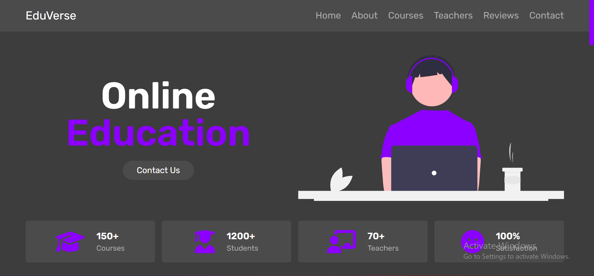

# EduVerse - Online Education Website
EduVerse is a responsive and dynamic online education website, designed to provide an immersive learning experience. This project utilizes HTML, CSS, and vanilla JavaScript to create a modern and user-friendly platform for accessing educational content. From courses to teachers and student reviews, EduVerse offers a comprehensive approach to online learning.



## Features:
- Responsive Design: EduVerse is built with a responsive layout, ensuring a seamless experience across various devices and screen sizes.
- Navigation: The navigation menu allows users to easily explore different sections of the website, including home, about, courses, teachers, reviews, and contact.
- Interactive Sliders: Utilizing the Swiper.js library, interactive sliders showcase courses, teachers, and student reviews, enhancing user engagement.
- Course Catalog: Explore a diverse range of courses, each with a brief description to guide users in their educational choices.
- Expert Tutors: Learn from experienced tutors who are experts in their fields. Connect with them through their profiles and social media links.
- Student Reviews: Read real student reviews to gain insights into the quality of courses and teaching.
- Contact Form: A user-friendly contact form allows visitors to get in touch, select courses, and provide essential details.


## Getting Started:
1. Clone this repository to your local machine.
```
git clone https://github.com/your-username/eduverse.git
```
2. Open the project folder in your preferred code editor.
3. Customize the content, styles, and images to fit your educational offerings.
4. Add your own courses, teacher profiles, and reviews to enhance the website's content.
5. Host the website on a web server to make it accessible online.
> [!NOTE]
> Feel free to customize and adapt this landing page template to fit your specific project or branding needs.


This site was built using [GitHub Pages](https://pages.github.com/).

Explore the ArtisticAlchemy Landing Page: [https://nisreensalameh.github.io/EduVerse/](https://nisreensalameh.github.io/EduVerse/)


## Dependencies
- Font Awesome: Used for icons and social media links.
- Swiper.js: Used for creating interactive sliders.


# Contributors
- Nisreen Salameh - Developer and Designer
